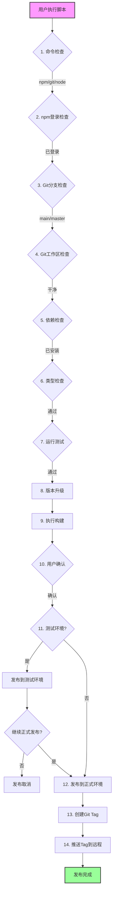

# dev-proxy-cookie 发布脚本设计分析

## 一、脚本概述

这是一个 **npm 自动化发布脚本**，实现了从代码检查到 npm 发布的完整流程：

```
检查 → 测试 → 版本升级 → 构建 → 确认 → 发布
```

## 二、核心设计优点

### 1. 流程化与事务性设计

**设计思想**：将发布流程分解为多个独立步骤，每个步骤有明确的成功/失败状态。

```bash
# 主流程 (main 函数)
check_command "npm"      # 命令检查
check_npm_login          # npm 登录检查
check_git_branch         # 分支检查
check_git_status         # 工作区检查
check_dependencies       # 依赖检查
run_lint                 # 类型检查
run_tests                # 测试
bump_version             # 版本升级
run_build                # 构建
confirm_publish          # 用户确认
publish_to_npm           # 发布
```

**优点**：

- **早期失败原则**：问题在早期发现，避免无效操作
- **事务性保障**：任一环节失败立即终止，避免半成品发布
- **可追踪性**：每个步骤有明确的日志输出

### 2. 安全防护机制

#### 2.1 Git 状态保护

```bash
check_git_status() {
if ! git diff --quiet; then
    error "存在未提交的更改，请先提交或 stash"
    exit 1
fi
if ! git diff --cached --quiet; then
    error "存在未提交的暂存更改，请先提交"
    exit 1
fi
}
```

**保护点**：

- 检测未跟踪的修改
- 检测已暂存但未提交的更改
- 确保发布前代码处于干净状态

#### 2.2 分支检查

```bash
if [ "$CURRENT_BRANCH" != "main" ] && [ "$CURRENT_BRANCH" != "master" ]; then
warning "当前分支不是 main/master"
read -p "确定要从当前分支发布吗? (y/N) " -n 1 -r
if [[ ! $REPLY =~ ^[Yy]$ ]]; then
    exit 0
fi
fi
```

**优点**：防止从错误分支意外发布

#### 2.3 npm 认证检查

```bash
check_npm_login() {
if ! npm whoami &> /dev/null; then
    # 检查 .npmrc 配置文件
    if [ -f "$HOME/.npmrc" ]; then
    if grep -q "//registry.npmjs.org/:_authToken" "$HOME/.npmrc"; then
        return  # 通过配置文件认证
    fi
    fi
    npm login  # 手动登录
fi
}
```

**优点**：

- 自动检测配置文件认证
- 支持全局和项目级 .npmrc
- 失败时引导用户登录

### 3. 版本管理策略

#### 3.1 分离版本更新与标签创建

```bash
# 版本升级阶段 - 只更新 package.json
npm version patch --no-git-tag-version

# 发布阶段 - 手动创建标签
if check_tag_exists "$new_version"; then
delete_existing_tag "$new_version"
fi
git tag "v$new_version"
git push origin "v$new_version"
```

**设计意图**：

- **解耦关注点**：版本更新和标签管理分开处理
- **事务一致性**：只有发布成功后才创建标签
- **冲突处理**：标签已存在时提供删除选项

#### 3.2 多版本类型支持

```bash
case $REPLY in
1) npm version patch --no-git-tag-version ;;   # bug修复
2) npm version minor --no-git-tag-version ;;   # 新功能
3) npm version major --no-git-tag-version ;;   # 重大变更
4) npm run bump:beta ;;                        # Beta测试版
5) npm run bump:alpha ;;                       # Alpha测试版
6) npm version "$VERSION" --no-git-tag-version ;; # 自定义
esac
```

**优点**：

- 符合 [Semantic Versioning](https://semver.org/) 规范
- 支持预发布版本（beta/alpha）
- 支持自定义版本号

### 4. 用户交互体验

#### 4.1 彩色输出

```bash
RED='\033[0;31m'
GREEN='\033[0;32m'
YELLOW='\033[1;33m'
BLUE='\033[0;34m'

info()    { echo -e "${BLUE}[INFO]${NC} $1"; }
success() { echo -e "${GREEN}[SUCCESS]${NC} $1"; }
warning() { echo -e "${YELLOW}[WARNING]${NC} $1"; }
error()   { echo -e "${RED}[ERROR]${NC} $1"; }
```

**优点**：

- 快速区分信息类型
- 提高可读性和用户体验

#### 4.2 确认机制

```bash
confirm_publish() {
echo "=========================================="
echo "          发布确认信息"
echo "=========================================="
echo "发布版本: v$new_version"
echo "发布标签: $(if [[ "$new_version" == *"-"* ]]; then echo "beta/alpha"; else echo "latest"; fi)"
echo "=========================================="

read -p "确认发布到 npm 吗? (y/N) " -n 1 -r
if [[ ! $REPLY =~ ^[Yy]$ ]]; then
    exit 0
fi
}
```

**优点**：

- 发布前展示关键信息
- 双重确认防止误操作
- 默认取消（N）更安全

### 5. 环境隔离

#### 5.1 测试环境发布

```bash
read -p "是否先发布到测试环境? (y/N) " -n 1 -r
if [[ $REPLY =~ ^[Yy]$ ]]; then
publish_to_npm_test  # npm publish --tag test
read -p "测试环境发布成功，是否继续发布到正式环境? (y/N) " -n 1 -r
if [[ ! $REPLY =~ ^[Yy]$ ]]; then
    exit 0
fi
fi
```

**优点**：

- 支持灰度发布流程
- 测试环境验证后再正式发布
- 降低发布风险

#### 5.2 Tag 自动选择

```bash
if [[ "$new_version" == *"-beta"* ]]; then
tag="beta"
elif [[ "$new_version" == *"-alpha"* ]]; then
tag="alpha"
else
tag="latest"
fi
npm publish --tag "$tag"
```

**优点**：

- 预发布版本自动使用 beta/alpha tag
- 避免覆盖 latest 版本
- 用户可选择安装特定版本

### 6. 函数化设计

```bash
# 职责单一的函数
check_command()    # 检查命令是否存在
check_npm_login()  # 检查 npm 登录状态
run_tests()        # 运行测试
run_build()        # 运行构建
bump_version()     # 版本升级
publish_to_npm()   # 发布到 npm
```

**优点**：

- **高内聚低耦合**：每个函数只做一件事
- **可复用性**：函数可单独调用
- **可测试性**：易于单元测试
- **可维护性**：定位问题更快速

### 7. 健壮性设计

#### 7.1 `set -e` 立即退出

```bash
set -e
```

**作用**：任何命令失败时立即终止脚本，防止错误传播

#### 7.2 错误处理与退出码

```bash
if ! npm publish; then
error "npm 发布失败"
exit 1
fi
```

#### 7.3 构建产物验证

```bash
run_build() {
npm run build
if [ ! -d "dist" ]; then
    error "构建失败，dist 目录不存在"
    exit 1
fi
}
```

## 三、流程时序图（三种展示方式）

```
用户执行脚本
    ↓
┌─────────────────────────────────────────┐
│  1. 命令检查 (npm, git, node)           │
│  2. npm 登录状态检查                     │
│  3. git 分支检查                        │
│  4. git 工作区状态检查                   │
│  5. 依赖安装检查                        │
│  6. 类型检查 (lint)                     │
│  7. 运行测试                            │
└─────────────────────────────────────────┘
    ↓ (全部通过)
┌─────────────────────────────────────────┐
│  8. 版本升级 (选择类型)                  │
│  9. 执行构建                            │
│ 10. 用户确认发布                        │
│ 11. [可选] 发布到测试环境                │
│ 12. 发布到正式环境                      │
│ 13. 创建 git tag                        │
│ 14. 推送 tag 到远程                     │
└─────────────────────────────────────────┘
    ↓
发布完成
```

### 3.1 文档展示：Mermaid 流程图（推荐）



**优点**：

- 支持交互式查看（可点击放大）
- 自动布局，美观清晰
- 支持条件分支展示
- GitHub、GitLab 等平台原生支持

### 3.2 快速参考：结构化表格

| 阶段               | 步骤 | 检查项            | 失败处理       |
| ------------------ | ---- | ----------------- | -------------- |
| **基础检查** | 1    | npm/git/node 命令 | 提示安装       |
|                    | 2    | npm 登录状态      | 引导登录       |
|                    | 3    | 当前分支          | 二次确认       |
|                    | 4    | Git 工作区        | 要求提交       |
|                    | 5    | 依赖安装          | 自动安装       |
| **质量保证** | 6    | 类型检查 (lint)   | 终止发布       |
|                    | 7    | 单元测试          | 终止发布       |
| **版本管理** | 8    | 版本升级          | 用户选择类型   |
|                    | 9    | 构建产物          | 验证 dist 目录 |
| **发布确认** | 10   | 用户确认          | 可取消         |
|                    | 11   | [可选] 测试环境   | 灰度发布       |
| **正式发布** | 12   | npm 发布          | 终止发布       |
|                    | 13   | 创建 Git Tag      | 处理冲突       |
|                    | 14   | 推送远程 Tag      | 完成           |

**优点**：

- 信息密度高，一目了然
- 便于快速查找特定步骤
- 适合打印或快速查阅

### 3.3 纯文本环境：ASCII 时间线

```
发布流程时间线
══════════════════════════════════════════════════════════════

[准备阶段]
    │
    ├─► 命令检查 (npm/git/node)
    ├─► npm 登录验证
    ├─► Git 分支检查
    └─► Git 工作区检查

[质量保证阶段]
    │
    ├─► 依赖安装检查
    ├─► 类型检查 (lint)
    └─► 单元测试执行

[版本与构建阶段]
    │
    ├─► 版本升级 (patch/minor/major/beta/alpha)
    └─► 构建产物验证

[发布阶段]
    │
    ├─► 用户确认
    ├─► [可选] 测试环境发布
    ├─► 正式 npm 发布
    ├─► 创建 Git Tag
    └─► 推送远程 Tag

══════════════════════════════════════════════════════════════
```

**优点**：

- 兼容性最强，所有终端都支持
- 纯文本格式，无需渲染引擎
- 结构清晰，层次分明

### 3.4 三种方式对比

| 场景                 | 推荐方案       | 理由           |
| -------------------- | -------------- | -------------- |
| **文档展示**   | Mermaid 流程图 | 可视化效果最好 |
| **快速参考**   | 结构化表格     | 信息密度高     |
| **纯文本环境** | ASCII 时间线   | 兼容性最强     |

## 四、学习要点总结

| 设计原则             | 实现方式               | 学习价值             |
| -------------------- | ---------------------- | -------------------- |
| **防御性编程** | `set -e`、多轮检查   | 避免错误状态传播     |
| **关注点分离** | 版本更新与标签创建分离 | 提高灵活性和可维护性 |
| **用户体验**   | 彩色输出、确认机制     | 降低操作风险         |
| **环境隔离**   | 测试环境 / 正式环境    | 支持灰度发布         |
| **函数化**     | 单一职责函数           | 提高代码复用性       |
| **语义化版本** | patch/minor/major      | 规范版本管理         |

## 五、可借鉴的实践

1. **发布前检查清单**：命令、登录状态、分支、工作区、依赖、测试
2. **版本管理策略**：遵循 Semantic Versioning
3. **确认机制**：关键操作前二次确认
4. **错误处理**：早期失败、清晰错误信息
5. **环境分离**：测试环境验证 → 正式发布

这个脚本是一个**生产级发布流程**的优秀范例，涵盖了安全性、可靠性和用户体验等多个维度。
